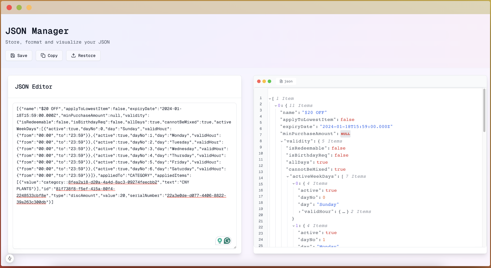

# JSON Manager

JSON editor and formatter for daily use



## Features

- 🔄 Real-time JSON validation and formatting
- 💾 Save and restore JSON files
- 📋 Copy formatted JSON to clipboard
- 🌗 Line numbers and code visualization
- ⚡ Built with Next.js and TypeScript for optimal performance

## Installation

1. Clone the repository:
```bash
git clone https://github.com/iqbaldp/json-manager.git
cd json-manager
```

2. Install dependencies:
```bash
pnpm install
```

3. Run the development server:
```bash
pnpm dev
```

Open [http://localhost:3000](http://localhost:3000) with your browser to see the result.

## Usage

1. **Edit JSON**: Paste your JSON into the editor on the left panel
2. **Validate**: The editor will automatically validate your JSON and show any errors
3. **Format**: Valid JSON is automatically formatted and displayed in the right panel
4. **Save**: Click the "Save" button to store your JSON for later use
5. **Restore**: Use the "Restore" button to load previously saved JSON files
6. **Copy**: Click "Copy" to copy the formatted JSON to your clipboard

## Technologies Used

- [Next.js](https://nextjs.org/)
- [TypeScript](https://www.typescriptlang.org/)
- [Tailwind CSS](https://tailwindcss.com/)
- [Radix UI](https://www.radix-ui.com/)

## Contributing

Contributions are welcome! Please feel free to submit a Pull Request. For major changes, please open an issue first to discuss what you would like to change.

1. Fork the Project
2. Create your Feature Branch (`git checkout -b feature/AmazingFeature`)
3. Commit your Changes (`git commit -m 'Add some AmazingFeature'`)
4. Push to the Branch (`git push origin feature/AmazingFeature`)
5. Open a Pull Request

## License

This project is licensed under the MIT License - see the [LICENSE](LICENSE) file for details.

## Support

If you like this project, please give it a ⭐️ on GitHub!